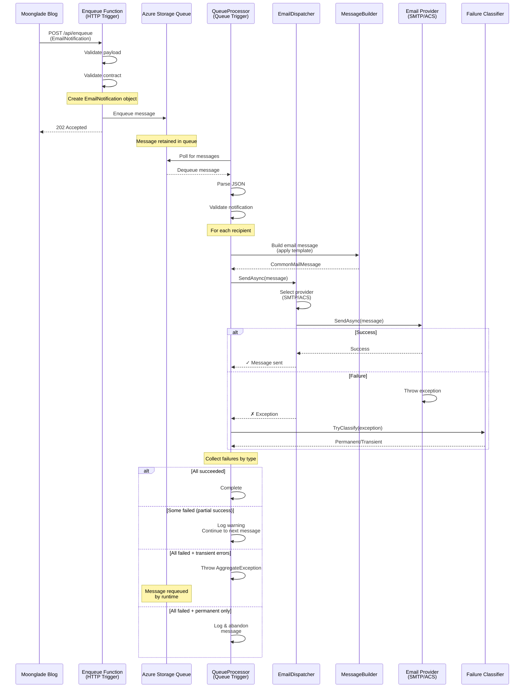

# Moonglade.Email

A serverless email notification system built on Azure Functions for the Moonglade blogging platform (https://edi.wang). This service handles asynchronous email delivery with support for multiple email providers, robust error handling, and message templating.

## Overview

Moonglade.Email is a distributed email service with the following features:

- **Dual-provider support**: SMTP and Azure Communication Service
- **Asynchronous processing**: Message queue-based architecture for reliable delivery
- **Intelligent failure handling**: Distinguishes between permanent and transient failures
- **Template-based rendering**: HTML email templates with dynamic content injection
- **Flexible message types**: Support for blog comments, replies, ping notifications, and test emails
- **Per-recipient error isolation**: One recipient's failure doesn't block delivery to others

## Technology Stack

| Component | Version | Alternative |
|-----------|---------|-------------|
| [.NET SDK](http://dot.net) | 10.0+ | N/A |
| [Visual Studio](https://visualstudio.microsoft.com/) | 2026+ | [VS Code](https://code.visualstudio.com/) |
| [Azure Functions](https://azure.microsoft.com/services/functions/) | Isolated Runtime | N/A |
| Cloud Storage | Azure Queue Storage | N/A |
| Email Providers | SMTP / Azure Communication Service | N/A |

## System Architecture & Workflow

### Message Flow Sequence Diagram



### Key Components

#### 1. **Enqueue Function** (`Enqueue.cs`)
- **Trigger**: HTTP POST request
- **Responsibility**: Validate and queue email notifications
- **Payload Validation**:
  - Schema validation (required fields)
  - Message type validation
  - Recipient list validation
  - Payload structure validation
- **Output**: Message enqueued to Storage Queue

#### 2. **QueueProcessor Function** (`QueueProcessor.cs`)
- **Trigger**: Storage Queue message
- **Responsibility**: Dequeue messages and dispatch emails
- **Workflow**:
  - Parse and validate JSON message
  - Build email from template
  - Send to each recipient individually
  - Classify and collect failures
  - Decide retry strategy based on failure types

#### 3. **EmailDispatcher** (`Core/EmailDispatcher.cs`)
- **Responsibility**: Provider selection and delegation
- **Logic**: 
  - Reads configuration to determine provider
  - Resolves corresponding `IEmailProviderSender` implementation
  - Delegates to SMTP or Azure Communication Service sender

#### 4. **Email Providers**
- **SmtpEmailSender** (`Core/SmtpEmailSender.cs`): SMTP-based delivery via MailKit
- **AzureCommunicationSender** (`AzureCommunicationSender.cs`): Azure Communication Service delivery

#### 5. **Failure Classification** (`Core/EmailDeliveryFailureClassifier.cs`)
Categorizes exceptions into two types:
- **Transient Failures**: Service temporarily unavailable, timeout, rate limit (can retry)
- **Permanent Failures**: Invalid email, unauthorized sender, malformed message (no retry)

#### 6. **MessageBuilder** (`Core/MessageBuilder.cs`)
- Retrieves email templates
- Maps data to template variables
- Supports multiple message types:
  - `TestMail`: Configuration validation
  - `NewCommentNotification`: Blog comment alerts
  - `AdminReplyNotification`: Admin reply notifications
  - `BeingPinged`: Pingback notifications

## Deployment & Configuration

### Option 1: Azure Communication Service (Recommended)

**Prerequisites:**
- Azure Storage Account
- Azure Communication Service with Email capability enabled

**Steps:**
1. Create a Storage Account in your Azure subscription
2. Create an Azure Communication Service resource and enable Email domain
3. Deploy the function app to Azure Functions
4. Configure the following environment variables:

```json
{
  "MOONGLADE_EMAIL_STORAGE": "<storage-account-connection-string>",
  "MOONGLADE_EMAIL_SENDER_NAME": "Moonglade Notification",
  "MOONGLADE_EMAIL_PROVIDER": "AzureCommunication",
  "MOONGLADE_EMAIL_ACS_CONN": "<azure-communication-service-connection-string>",
  "MOONGLADE_EMAIL_ACS_ADDR": "<verified-sender-email-address>"
}
```

### Option 2: SMTP

> **⚠️ Note**: Only basic SMTP authentication is supported. Microsoft 365 has disabled basic authentication, so this won't work with Microsoft 365 enterprise or personal accounts. Use a third-party SMTP provider or Azure Communication Service instead.

**Prerequisites:**
- Azure Storage Account
- SMTP server with credentials

**Steps:**
1. Create a Storage Account in your Azure subscription
2. Deploy the function app to Azure Functions
3. Configure the following environment variables:

```json
{
  "MOONGLADE_EMAIL_STORAGE": "<storage-account-connection-string>",
  "MOONGLADE_EMAIL_SENDER_NAME": "Moonglade Notification",
  "MOONGLADE_EMAIL_PROVIDER": "smtp",
  "MOONGLADE_EMAIL_SSL": true,
  "MOONGLADE_EMAIL_SMTP_PORT": 587,
  "MOONGLADE_EMAIL_SMTP_SERVER": "smtp.example.com",
  "MOONGLADE_EMAIL_SMTP_USER": "noreply@example.com",
  "MOONGLADE_EMAIL_SMTP_PASS": "<smtp-password>"
}
```

## Moonglade Blog Integration

To enable email notifications in your Moonglade blog instance, update the configuration:

**File**: `appsettings.json` (in your Moonglade blog)

```json
{
  "Email": {
    "ApiEndpoint": "https://<your-function-app-url>",
    "ApiKey": "<your-function-app-key>",
    "ApiKeyHeader": "x-functions-key"
  }
}
```

**To get your Function App URL and key:**
1. Navigate to your Azure Function App
2. Find the "Enqueue" function
3. Click "Get Function URL" and copy the full URL (this is your ApiEndpoint)
4. The `code` parameter in the URL is your ApiKey

## Local Development & Debugging

### Prerequisites

1. [Azure Storage Emulator](https://docs.microsoft.com/azure/storage/common/storage-use-emulator) or [Azurite](https://github.com/Azure/Azurite) (for local storage queue simulation)
2. .NET 10.0 SDK
3. Azure Functions Core Tools

### Setup

Create a `local.settings.json` file in `./src/Moonglade.Function.Email/` (this file is git-ignored):

**Configuration for SMTP**:

```json
{
  "IsEncrypted": false,
  "Values": {
    "AzureWebJobsStorage": "UseDevelopmentStorage=true",
    "FUNCTIONS_WORKER_RUNTIME": "dotnet-isolated",
    "MOONGLADE_EMAIL_STORAGE": "UseDevelopmentStorage=true",
    "MOONGLADE_EMAIL_SENDER_NAME": "Moonglade Email (Local Dev)",
    "MOONGLADE_EMAIL_PROVIDER": "smtp",
    "MOONGLADE_EMAIL_SSL": true,
    "MOONGLADE_EMAIL_SMTP_PORT": 587,
    "MOONGLADE_EMAIL_SMTP_SERVER": "smtp.gmail.com",
    "MOONGLADE_EMAIL_SMTP_USER": "your-email@gmail.com",
    "MOONGLADE_EMAIL_SMTP_PASS": "<app-password>"
  }
}
```

**Configuration for Azure Communication Service**:

```json
{
  "IsEncrypted": false,
  "Values": {
    "AzureWebJobsStorage": "UseDevelopmentStorage=true",
    "FUNCTIONS_WORKER_RUNTIME": "dotnet-isolated",
    "MOONGLADE_EMAIL_STORAGE": "UseDevelopmentStorage=true",
    "MOONGLADE_EMAIL_SENDER_NAME": "Moonglade Email (Local Dev)",
    "MOONGLADE_EMAIL_PROVIDER": "AzureCommunication",
    "MOONGLADE_EMAIL_ACS_CONN": "<your-acs-connection-string>",
    "MOONGLADE_EMAIL_ACS_ADDR": "<verified-sender-email@xxx.azurecomm.net>"
  }
}
```

### Running Locally

1. **Start the storage emulator**:
   ```powershell
   # If using Azurite (recommended)
   azurite --silent --location ./azurite-data
   ```

2. **Run the function app**:
   ```bash
   cd ./src/Moonglade.Function.Email
   func start
   ```

3. **Test the Enqueue endpoint**:
   ```bash
   curl -X POST http://localhost:7071/api/Enqueue \
     -H "Content-Type: application/json" \
     -d '{
       "type": "TestMail",
       "recipients": ["recipient@example.com"],
       "payload": {}
     }'
   ```

## Project Structure

```
Moonglade.Email/
├── src/
│   ├── Moonglade.Function.Email/           # Main function app
│   │   ├── Core/                           # Core business logic
│   │   │   ├── EmailDispatcher.cs          # Provider selection & delegation
│   │   │   ├── SmtpEmailSender.cs          # SMTP provider implementation
│   │   │   ├── EmailDeliveryFailureClassifier.cs  # Error categorization
│   │   │   ├── MessageBuilder.cs           # Template rendering
│   │   │   ├── EmailNotification.cs        # Message model
│   │   │   └── ... other core classes
│   │   ├── Payloads/                       # Message type payloads
│   │   │   ├── NewCommentPayload.cs
│   │   │   ├── CommentReplyPayload.cs
│   │   │   └── PingPayload.cs
│   │   ├── Enqueue.cs                      # HTTP trigger function
│   │   ├── QueueProcessor.cs               # Queue trigger function
│   │   ├── Program.cs                      # Dependency injection setup
│   │   ├── AzureCommunicationSender.cs     # ACS provider implementation
│   │   ├── mailConfiguration.xml           # Email templates
│   │   └── host.json
│   ├── Moonglade.Function.Email.Tests/     # Unit tests
│   └── TestClient/                         # Test client for manual testing
└── Dockerfile                              # Container image
```

## Email Template Configuration

Email templates are defined in `mailConfiguration.xml` and managed by the `Edi.TemplateEmail` library. Templates support:
- Dynamic variable substitution
- HTML and plain text formats
- Multiple message types

### Supported Message Types

| Type | Description | Used For |
|------|-------------|----------|
| `TestMail` | Configuration validation | Verifying SMTP/ACS setup |
| `NewCommentNotification` | New comment alert | Blog comment notifications |
| `AdminReplyNotification` | Admin reply notification | Admin reply alerts |
| `BeingPinged` | Pingback notification | Pingback alerts |

## API Contract

### Enqueue Endpoint

**Endpoint**: `POST /api/Enqueue`

**Required Headers**:
```
Authorization: Bearer <function-key>
Content-Type: application/json
```

**Request Body**:
```json
{
  "type": "NewCommentNotification | AdminReplyNotification | BeingPinged | TestMail",
  "recipients": ["email1@example.com", "email2@example.com"],
  "originAspNetRequestId": "optional-correlation-id",
  "payload": {
    // Payload structure depends on message type
  }
}
```

**Success Response**: `202 Accepted`

**Error Response**: `400 Bad Request`
```json
{
  "errors": ["validation error 1", "validation error 2"]
}
```

## Error Handling & Retry Logic

The system implements intelligent failure handling:

### Transient Failures (Retryable)
- Service unavailable (5xx errors)
- Timeout
- Rate limiting (429)
- SMTP temporary failures

**Action**: Message is requeued automatically for retry by Azure Functions runtime

### Permanent Failures (Non-retryable)
- Invalid email address (4xx errors)
- Sender not verified
- Message malformed
- Permission denied

**Action**: Message is logged and discarded (no retry)

### Partial Success Handling
If multiple recipients fail:
- Successfully sent recipients: ✓ No action needed
- Failed recipients: Collected and logged by failure type
- If ALL recipients fail AND transient errors exist: Message requeued
- If ALL recipients fail AND only permanent errors: Message discarded
